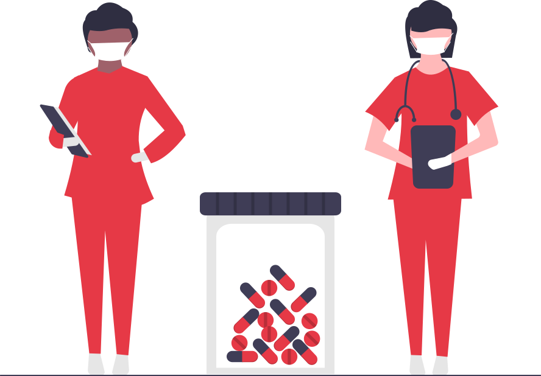

# MCOV Test Center Webpage Example

This project is a study case for a simple web application designed for a COVID-19 test center. It includes a front-end landing page and a Node.js server using EJS templating. The application aims to provide a lightweight platform to showcase test center services, allow appointment booking, and display important health information.

> ⚠️ This is a **study/demo project** and not intended for production use without proper validation, security, and data protection compliance.

---

## 🚀 Features

- Responsive landing page with service information
- Appointment booking form
- Server-side rendering using EJS
- Basic server setup with Node.js and Express
- Modular static assets (CSS, JS, images)

---

## 🧰 Tech Stack

- **Frontend:** HTML, CSS, Vanilla JavaScript
- **Templating Engine:** EJS
- **Backend:** Node.js with Express
- **Environment Configuration:** dotenv
- **Package Management:** npm

---

## 📦 Project Structure

```
MCOV-Testzentrum-Webpage-Example/
├── assets/
│   ├── css/
│   ├── js/
│   └── images/
├── node_modules/
├── .gitattributes
├── config.env
├── package.json
├── package-lock.json
├── server.js
└── README.md
```

---

## 🛠️ Getting Started

### 1. Clone the repository
```bash
git clone https://github.com/yourusername/MCOV-Testzentrum-Webpage-Example.git
cd MCOV-Testzentrum-Webpage-Example
```

### 2. Install dependencies
```bash
npm install
```

### 3. Configure environment
Create a `.env` or update `config.env` with the following:
```env
PORT=3000
```

### 4. Run the development server
```bash
node server.js
```
Then go to `http://localhost:3000` in your browser.

---

## 📸 Preview



---

## 📄 License

This project is open for educational purposes. Feel free to reuse parts of the code but always comply with proper security and privacy standards when building similar applications.

---

## ✍️ Author

Made by [Your Name] — inspired by the need for digital solutions during the pandemic.
